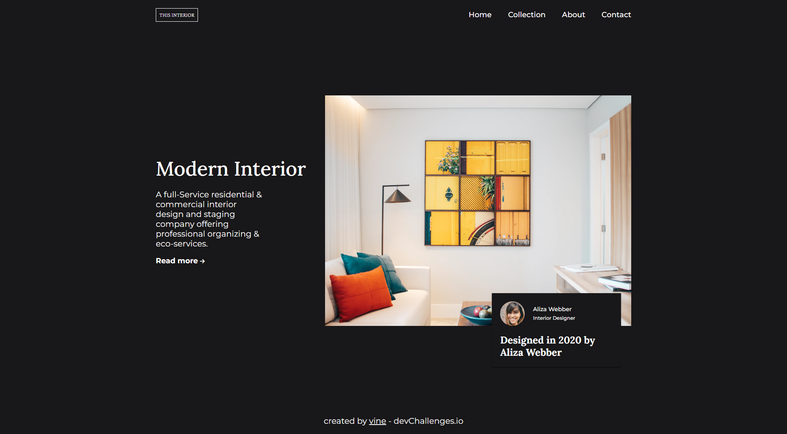

<!-- Please update value in the {}  -->

<h1 align="center">Interior Consultant</h1>

   Solution for a challenge from  <a href="http://devchallenges.io" target="_blank">Devchallenges.io</a>.

    <a href="https://vinepereira.github.io/Interior-Consultant-Dev-Challenges/">
      Solution
    </a>
     | 
    <a href="https://www.figma.com/file/3cf83hHRBAGjG5EKPcG2bV/interior-consultant-challenge?node-id=0%3A1&t=uiPgkMxX2TqAFZ9f-0">
      Challenge
    </a>
  </h3>

## Overview

### Built With

- HTML
- CSS
- JavaScript

## Features

- This application/site was created as a submission to a [DevChallenges](https://devchallenges.io/challenges) challenge. The [challenge](https://devchallenges.io/challenges/wBunSb7FPrIepJZAg0sY) was to build an application to complete the given user stories.
- Responsive using display Grid & Flexbox.
- Animations on links, buttons and cards.
- Toggle burguer menu.

## Contact
- GitHub [@vinepereira](https://github.com/vinepereira)

